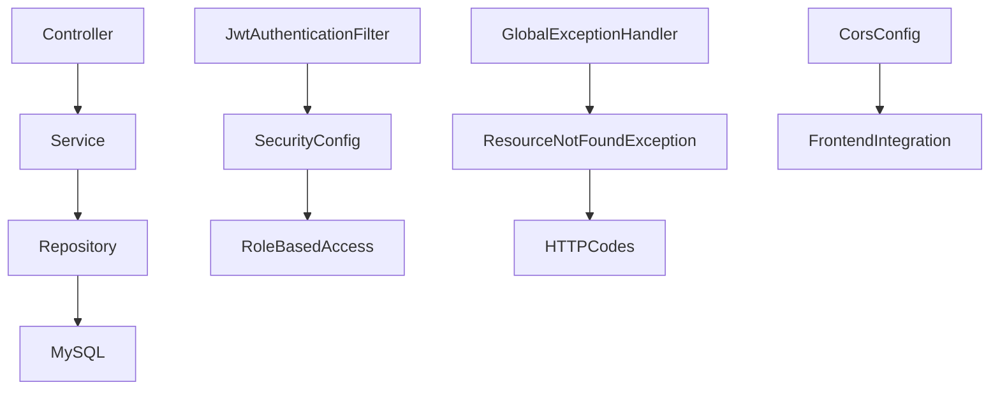

## SmartTravel 🌍 

A **full-stack Java Spring Boot** city exploration and travel discovery platform featuring Indian cities, category-based browsing, hidden gems, and per-user favourites. Currently 12 cities are showcased in the frontend demo, with the backend architecture designed to scale to 50+ cities via admin APIs.


## ✨ Features

### 🔐 JWT Authentication

- User registration and login
- BCrypt password hashing
- Role-based access control (`ROLE_USER`, `ROLE_ADMIN`)


### Favourites System  

Add/remove cities per user (private/isolated)


### City Categories 

Mountains ⛰️

Beaches 🏖️

Heritage 🏛️

Religious 🛕

Food Street 🍜

Adventure🧗

Party 🎉

Hidden Gems 💎


### REST APIs 

Pagination, sorting, and case-insensitive partial search (name/state/country)


### Swagger UI 

Interactive API docs + JWT auth support


### Frontend features

1. Dark/Light mode, 
2. Real-time Fetch API

### Testing

10 JUnit + 
Mockito tests (0 failures), 
H2 test DB

## 🛠 Tech Stack
| Layer | Technology |
| --- | --- |
| Backend | Java 17, Spring Boot 2.7.18 |
| Security | Spring Security, JWT (jjwt 0.11.5), BCrypt |
| Database | MySQL 8.0 (production), H2 (testing) |
| ORM | Spring Data JPA, Hibernate |
| Frontend | HTML5, CSS3, Vanilla JS, Fetch API |
| API Docs | Swagger UI (springdoc-openapi 1.7.0) |
| Testing | JUnit 5, Mockito, MockMvc |
| Build Tools| Maven |

## Quick Start
### Prerequisites

- Java 17+
  
- Maven 3.8+
  
- MySQL 8.0+

### Run Locally
```bash
git clone https://github.com/mppurswani/smarttravel.git
cd smarttravel
```

Update src/main/resources/application.properties:
```bash
spring.datasource.url=jdbc:mysql://localhost:3306/smarttravel
spring.datasource.username=YOUR_USERNAME
spring.datasource.password=YOUR_PASSWORD
```

**Run**:
```bash
mvn clean install
mvn spring-boot:run
```

### Service URLs

Frontend →
http://localhost:8080

API Base →
http://localhost:8080/api

Swagger UI →
http://localhost:8080/swagger-ui.html


## API Endpoints
### Auth (Public)

| Method | Endpoint | Description |
| --- | --- | --- |
| POST | /api/auth/register | Register new user and return JWT  |
| POST | /api/auth/login |  Login and return JWT |


### Cities (Public)
| Method | Endpoint | Description |
| --- | --- | --- |
| GET | /api/cities/all | All cities |
| GET | /api/cities?page=0&size=10 | Paginated |
| GET | /api/cities/{id} | City by ID |
| GET | /api/cities/search?name=Delhi | Fuzzy search |
| GET | /api/cities/category/BEACHES | Filter category |
| GET | /api/cities/hidden-gems | Hidden gems 💎 |


### Cities (Admin Only)
| Method | Endpoint | Description |
| --- | --- | --- |
| POST | /api/cities | Add city |
| DELETE | /api/cities/{id} | Delete city |

### Favourites (Login Required)
| Method | Endpoint | Description |
| --- | --- | --- |
| GET | /api/favourites | My favourites |
| POST | /api/favourites/{cityId} | Add favourite |
| DELETE | /api/favourites/{cityId} | Remove favourite |


## Architecture diagram:


## Core Package Structure:
```text
com.travel.smarttravel/
├── SmartTravelApplication.java
├── config/              → SecurityConfig, SwaggerConfig, CorsConfig
├── controller/          → AuthController, CityController, FavouriteController
├── dto/                 → CityDTO, AuthRequest, AuthResponse
├── entity/              → City, User, FavouriteCity, CityCategory
├── exception/           → GlobalExceptionHandler, ResourceNotFoundException
├── repository/          → CityRepository, UserRepository, FavouriteCityRepository
├── security/            → JwtUtil, JwtAuthenticationFilter, UserDetailsServiceImpl
└── service/             → CityService, FavouriteService, impl/CityServiceImpl, FavouriteServiceImpl
```

## 🏙️ Frontend Demo Cities (Currently Showcased)

The frontend currently showcases **12 curated Indian cities** across multiple categories:

- **HERITAGE 🏛️** — Ahmedabad, Delhi, Jaipur, Kolkata
- **PARTY 🎉** — Bengaluru, Pune
- **MOUNTAINS ⛰️** — Chandigarh
- **BEACHES 🏖️** — Chennai, Kochi
- **FOOD_STREET 🍜** — Hyderabad, Mumbai
- **RELIGIOUS 🛕** — Varanasi

Additional categories such as **ADVENTURE 🧗** and **HIDDEN_GEM 💎** are supported by the backend/admin workflow and can be expanded further.

These cities include curated details such as:
- Culture overview
- Popular attractions
- Famous local food
- Best time to visit (for selected cities)
- Language (for selected cities)
- Entry fee (for selected cities)

## City Categories
| Category | Emoji | Examples |
| --- | --- | --- |
| MOUNTAINS | ⛰️ | Chandigarh |
| BEACHES | 🏖️ | Chennai, Kochi |
| HERITAGE | 🏛️ | Delhi, Kolkata, Jaipur |
| RELIGIOUS | 🛕 | Varanasi |
| FOOD_STREET | 🍜 | Hyderabad, Mumbai |
| PARTY | 🎉 | Bengaluru, Pune |
| HIDDEN_GEMS | 💎 | Admin can add |
| ADVENTURE | 🧗 | Admin can add |

## 🔐 Security

- BCrypt-hashed passwords (never stored in plaintext)
- JWT-based authentication with token expiry
- Role-based access control:
  - `ROLE_ADMIN` → add/delete cities
  - `ROLE_USER` → manage favourites
- Protected endpoints return proper `401/403` responses
- Per-user favourites remain isolated through authenticated JWT identity

## 🧪 Testing
```bash
mvn test
```

### Results:
Tests run: 10, Failures: 0, Errors: 0, Skipped: 0

### Breakdown:

CityControllerTest → 4 tests (MockMvc)
CityServiceTest → 5 tests (Mockito)
SmartTravelApplicationTests → 1 test (context)


## ⚡Performance


- Pagination support for scalable city listing
  
- Case-insensitive partial search by name, state, and country
  
- Stateless JWT-based authentication flow
  
- Lightweight demo dataset with scalable admin-driven expansion
  
- Search across city name, state, and country fields


## 👨‍💻 Author

Mayank Purswani  
📧 mayankhero2004@gmail.com


