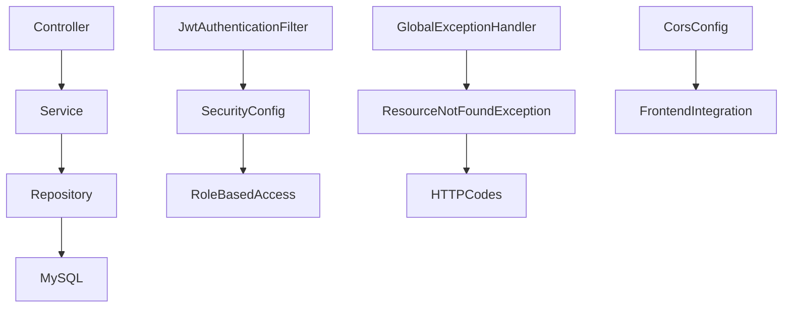

**SmartTravel 🌍 
(Production-Ready)**
Production-ready full-stack Java Spring Boot application exploring **50+ Indian cities** with culture, food, hidden gems, and personalized travel recommendations.
Currently **12 cities preloaded**, scalable to 50+ via admin panel.

✨ **Features**
JWT Authentication —
Register/login, BCrypt passwords, role-based access (USER/ADMIN)

**Favourites System** — 
Add/remove cities per user (private/isolated)

**City Categories** —
Mountains ⛰️, Beaches 🏖️, Heritage 🏛️, Religious 🛕, Food Street 🍜, Adventure, Party 🎉, Hidden Gems 💎

**REST APIs** —
Pagination, sorting, fuzzy search (name/state/country)

**Swagger UI** — 
Interactive API docs + JWT auth support

**Responsive UI** — 
Dark/Light mode, real-time Fetch API

**Testing** — 
10 JUnit + Mockito tests (0 failures), H2 test DB

🛠 **Tech Stack**
| Layer | Technology |
| --- | --- |
| Backend | Java 17, Spring Boot 2.7.18 |
| Security | Spring Security, JWT (jjwt 0.11.5), BCrypt |
| Database | MySQL 8.0 (prod), H2 (test) |
| ORM | Spring Data JPA, Hibernate |
| Frontend | HTML5, CSS3, Vanilla JS, Fetch API |
| API Docs | Swagger UI (springdoc-openapi 1.7.0) |
| Testing | JUnit 5, Mockito, MockMvc |
| Build | Maven |

**Quick Start**
**Prerequisites**
Java 17+
Maven 3.8+
MySQL 8.0+

**Run Locally**
```bash
git clone https://github.com/mppurswani/smarttravel.git
cd smarttravel
```

Update src/main/resources/application.properties:
```bash
spring.datasource.url=jdbc:mysql://localhost:3306/smarttravel
spring.datasource.username=YOUR_USERNAME
spring.datasource.password=YOUR_PASSWORD
```

**Run**:
```bash
mvn clean install
mvn spring-boot:run
```

**Service URLs**
Frontend → http://localhost:8080

API Base → http://localhost:8080/api

Swagger UI → http://localhost:8080/swagger-ui.html


**API Endpoints
Auth (Public)**

| Method | Endpoint | Description |
| --- | --- | --- |
| POST | /api/auth/register | Create account (JWT) |
| POST | /api/auth/login | Login (JWT) |


**Cities (Public)**
| Method | Endpoint | Description |
| --- | --- | --- |
| GET | /api/cities/all | All cities |
| GET | /api/cities?page=0&size=10 | Paginated |
| GET | /api/cities/{id} | City by ID |
| GET | /api/cities/search?name=Delhi | Fuzzy search |
| GET | /api/cities/category/BEACHES | Filter category |
| GET | /api/cities/hidden-gems | Hidden gems 💎 |


**Cities (Admin Only)**
| Method | Endpoint | Description |
| --- | --- | --- |
| POST | /api/cities | Add city |
| DELETE | /api/cities/{id} | Delete city |

**Favourites (Login Required)**
| Method | Endpoint | Description |
| --- | --- | --- |
| GET | /api/favourites | My favourites |
| POST | /api/favourites/{cityId} | Add favourite |
| DELETE | /api/favourites/{cityId} | Remove favourite |


**Architecture diagram**:


**Package Structure**:
```text
com.travel.smarttravel/
├── config/          → SecurityConfig, SwaggerConfig, CorsConfig
├── controller/      → CityController, AuthController, FavouriteController
├── dto/             → CityDTO, AuthRequest, AuthResponse
├── entity/          → City, User, FavouriteCity, CityCategory (enum)
├── exception/       → ResourceNotFoundException
├── repository/      → CityRepository, UserRepository, FavouriteCityRepository
├── security/        → JwtUtil, JwtAuthenticationFilter, UserDetailsServiceImpl
└── service/         → CityService, FavouriteService, impl/CityServiceImpl
```

**City Categories**
| Category | Emoji | Examples |
| --- | --- | --- |
| MOUNTAINS | ⛰️ | Chandigarh |
| BEACHES | 🏖️ | Chennai, Kochi |
| HERITAGE | 🏛️ | Delhi, Kolkata, Jaipur |
| RELIGIOUS | 🛕 | Varanasi |
| FOOD_STREET | 🍜 | Hyderabad, Mumbai |
| PARTY | 🎉 | Bengaluru, Pune |
| HIDDEN_GEM | 💎 | Admin can add |

🔐 **Security**
BCrypt hashed passwords (never plaintext)

JWT tokens expire after 24h

Role-based access (ADMIN: add/delete cities)

Session isolation — private user favourites

Protected endpoints — 401/403 without valid token

🧪 **Testing**
```bash
mvn test
```

**Results**:
Tests run: 10, Failures: 0, Errors: 0, Skipped: 0

**Breakdown**:

CityControllerTest → 4 tests (MockMvc)
CityServiceTest → 5 tests (Mockito)
SmartTravelApplicationTests → 1 test (context)


⚡**Performance**
Pagination: ~50ms avg (12-city dataset)

Fuzzy search: MySQL LIKE + JPA derived queries

JWT validation: Stateless (no DB hit/request)

Memory: <200MB heap usage


👨‍💻 **Author**
Mayank Purswani  
📧 mayankhero2004@gmail.com


