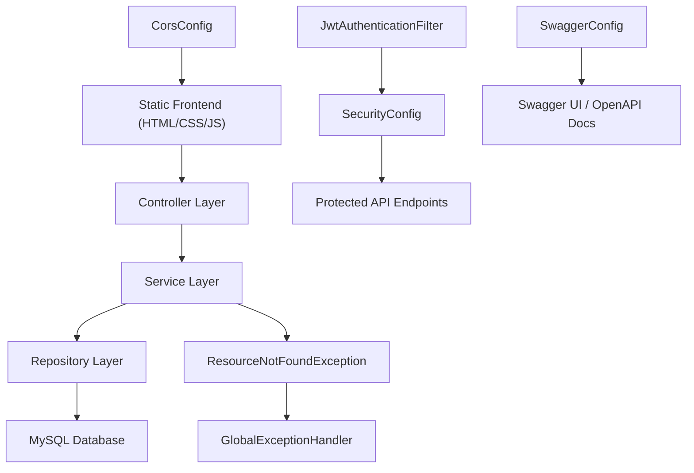

## SmartTravel 🌍 

A **full-stack Java Spring Boot** city exploration and travel discovery platform featuring Indian cities, category-based browsing, hidden gems, and per-user favourites. The current demo showcases 100+  curated cities , while the backend architecture supports scalable city expansion through admin APIs.
Designed with production-level practices including data integrity constraints, secure configuration management, and scalable REST architecture.

## ✨ Features

### 🔐 JWT Authentication

- User registration and login
- BCrypt password hashing
- Role-based access control (`ROLE_USER`, `ROLE_ADMIN`)


### Favourites System  

Add/remove cities per user (private/isolated)


### City Categories 

Mountains ⛰️

Beaches 🏖️

Heritage 🏛️

Religious 🛕

Food Street 🍜

Adventure🧗

Party 🎉

Hidden Gems 💎


### REST APIs 

Case-insensitive keyword search across city name,state,country.


### Swagger UI 

Interactive API docs + JWT auth support


### Frontend features

1. Dark/Light mode, 
2. Dynamic data rendering using Fetch API

### Testing
- Unit and application context tests using JUnit 5 and  Mockito.
- H2 used for test configuration
- Current test suite passes successfully

### 🧹 Data Integrity Improvements
- Removed duplicate city entries using optimized SQL queries
- Enforced uniqueness using composite constraint (name, state, country)
- Ensures clean search results and consistent API responses

 ### 🔐 Configuration Security
- Sensitive credentials (DB password, JWT secret) are externalized using environment variables
- Prevents exposure of secrets in source code

  
## 🛠 Tech Stack
| Layer | Technology |
| --- | --- |
| Backend | Java 17, Spring Boot 2.7.18 |
| Security | Spring Security, JWT (jjwt 0.11.5), BCrypt |
| Database | MySQL 8.0 (production), H2 (testing) |
| ORM | Spring Data JPA, Hibernate |
| Frontend | HTML5, CSS3, Vanilla JS, Fetch API |
| API Docs | Swagger UI (springdoc-openapi 1.7.0) |
| Testing | JUnit 5, Mockito, MockMvc |
| Build Tools| Maven |

## Quick Start
### Prerequisites

- Java 17+
  
- Maven 3.8+
  
- MySQL 8.0+

### Run Locally
```bash
git clone https://github.com/mppurswani/smarttravel.git
cd smarttravel
```

Update src/main/resources/application.properties:
```bash
spring.datasource.url=jdbc:mysql://localhost:3306/smarttravel
spring.datasource.username=YOUR_USERNAME
spring.datasource.password=YOUR_PASSWORD
```

**Run**:
```bash
mvn clean install
mvn spring-boot:run
```

### Service URLs

Frontend →
http://localhost:8080

API Base →
http://localhost:8080/api

Swagger UI →
http://localhost:8080/swagger-ui/index.html


## API Endpoints
### Auth (Public)

| Method | Endpoint | Description |
| --- | --- | --- |
| POST | /api/auth/register | Register new user and return JWT  |
| POST | /api/auth/login |  Login and return JWT |


### Cities (Public)
| Method | Endpoint | Description |
| --- | --- | --- |
| GET | /api/cities | All cities |
| GET | /api/cities/{id} | City by ID |
| GET | /api/cities/search?keyword=Delhi | Fuzzy search |
| GET | /api/cities/category/BEACHES | Filter category |
| GET | /api/cities/hidden-gems | HIDDEN_GEM 💎 |


### Cities (Admin Only)
| Method | Endpoint | Description |
| --- | --- | --- |
| POST | /api/cities | Add city |
| DELETE | /api/cities/{id} | Delete city |

### Favourites (Login Required)
| Method | Endpoint | Description |
| --- | --- | --- |
| GET | /api/favourites | My favourites |
| POST | /api/favourites/{cityId} | Add favourite |
| DELETE | /api/favourites/{cityId} | Remove favourite |


## Architecture diagram:

## Core Package Structure:
```text
com.travel.smarttravel/
├── SmartTravelApplication.java
├── CorsConfig.java
├── config/
│   ├── LocaleConfig.java
│   ├── SecurityConfig.java
│   └── SwaggerConfig.java
├── controller/
│   ├── AuthController.java
│   ├── CityController.java
│   ├── FavouriteController.java
│   ├── HealthController.java
│   └── exception/
│       └── GlobalExceptionHandler.java
├── dto/
│   ├── AuthRequest.java
│   ├── AuthResponse.java
│   └── CityDTO.java
├── entity/
│   ├── City.java
│   ├── CityCategory.java
│   ├── FavouriteCity.java
│   └── User.java
├── exception/
│   └── ResourceNotFoundException.java
├── repository/
│   ├── CityRepository.java
│   ├── FavouriteCityRepository.java
│   └── UserRepository.java
├── security/
│   ├── JwtAuthenticationFilter.java
│   ├── JwtUtil.java
│   └── UserDetailsServiceImpl.java
└── service/
    ├── CityService.java
    ├── FavouriteService.java
    └── impl/
        └── CityServiceImpl.java
```

## 🏙️ Frontend Demo Cities (Currently Showcased)

The frontend currently showcases **100+ curated Indian cities** across multiple categories:

- **HERITAGE 🏛️** — Delhi, Kolkata, Jaipur, Srinagar, Mysore,etc
- **PARTY 🎉** — Bengaluru, Pune,Lucknow,Indore,etc
- **MOUNTAINS ⛰️** — Chandigarh,Mukteshwar,Nainital,Pahalgam,Mussoorie,etc
- **BEACHES 🏖️** — Chennai, Kochi,Goa,Kovalam,Pondicherry,etc
- **FOOD_STREET 🍜** — Hyderabad, Mumbai,Nagpur,Patna,Kanpur,etc
- **RELIGIOUS 🛕** — Varanasi,Haridwar,Amritsar,Ujjain,Ayodhya,etc
- **ADVENTURE 🧗**— Rishikesh,Auli,Manali,Spiti Valley,Chopta,etc
- **HIDDEN_GEM 💎**—  Dawki,Alleppey,Cherrapunji,Lakshadweep,Hampi,etc

These cities include curated details such as:
- Culture overview
- Popular attractions
- Famous local food
- Best time to visit (for selected cities)
- Language (for selected cities)
- Entry fee (for selected cities)

## City Categories
| Category | Emoji | Examples |
| --- | --- | --- |
| MOUNTAINS | ⛰️ | Chandigarh, Mukteshwar, Nainital, Pahalgam, Mussoorie,etc |
| BEACHES | 🏖️ | Chennai, Kochi, Goa, Kovalam, Pondicherry,etc |
| HERITAGE | 🏛️ | Delhi, Kolkata, Jaipur, Srinagar, Mysore,etc |
| RELIGIOUS | 🛕 | Varanasi, Haridwar, Amritsar, Ujjain, Ayodhya,etc |
| FOOD_STREET | 🍜 | Hyderabad, Mumbai, Nagpur, Patna, Kanpur,etc |
| PARTY | 🎉 | Bengaluru, Pune, Lucknow, Indore,etc |
| HIDDEN_GEM | 💎 | Dawki, Alleppey, Cherrapunji, Lakshadweep, Hampi,etc |
| ADVENTURE | 🧗 | Rishikesh, Auli, Manali, Spiti Valley, Chopta,etc |

## 🔐 Security

- BCrypt-hashed passwords (never stored in plaintext)
- JWT-based authentication with token expiry
- Role-based access control:
  - `ROLE_ADMIN` → add/delete cities
  - `ROLE_USER` → manage favourites
- Protected endpoints return proper `401/403` responses
- Per-user favourites remain isolated through authenticated JWT identity

## 🧪 Testing
```bash
mvn test
```

### Results:
Current test suite passes successfully with 0 failures.

### Included Test Classes:
-CityServiceTest
-SmartTravelApplicationTests

### Breakdown:

CityControllerTest → 4 tests (MockMvc)
CityServiceTest → 5 tests (Mockito)
SmartTravelApplicationTests → 1 test (context)


## 🐳 Docker Support
The project includes Docker configuration for containerized deployment.

### Build Docker Image
```bash
docker build -t smarttravel .
```
### Run
```bash
docker run -p 8080:8080 smarttravel
```
### Benefits
- Consistent environment across systems
- Easy deployment on cloud platforms (Railway, Render, etc.)


## 🚀 Deployment

The application is containerized using Docker and can be deployed on cloud platforms.

### Previous Deployment
- Deployed on Railway using Docker containerization
- Backend + MySQL configured via environment variables

### Current Deployment Plan
- Backend → Render (Spring Boot API hosting)
- Frontend → Vercel (Static hosting)

### Deployment Features
- Environment-based configuration (DB URL, JWT secret)
- Production-ready REST API structure
- Scalable architecture for cloud platforms

## ⚡Performance

- Case-insensitive partial search across city name, state, and country
- Stateless JWT-based authentication flow
- Lightweight demo dataset with admin-driven expansion support


## 👨‍💻 Author

Mayank Purswani  
📧 mayankhero2004@gmail.com


